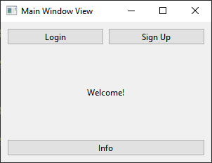
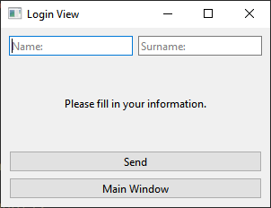
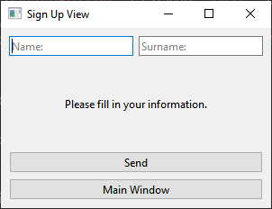
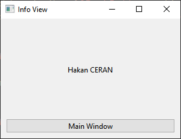

# MVC Example

Model View Controller Example #C++ #Qt #MVC

## Views

- ### Main Window View
    

- ### Login View
    

- ### Sign Up View
    

- ### Info View
    

## Model

User Class

## Controller

Controller Class
